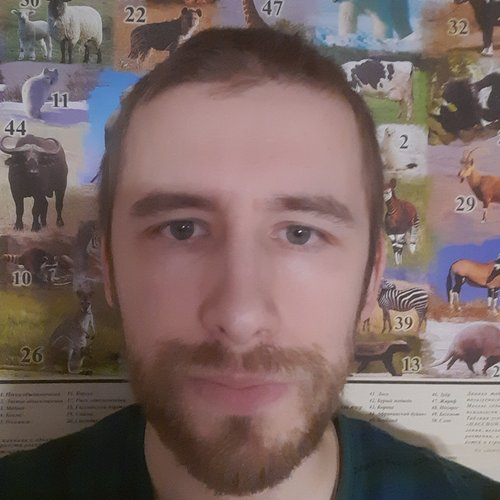

 
[Пути развития робототехники в гимназии](robot.md)
[Благодарности](gratitude.md)
[Дипломы](diplom.md)
[Опыт работы](work_experience.md)
[Кондак св. Кириллу и Мефодию, учителем Словенским](kondak.md)
[Конспекты по информатике](https://nazarovki.github.io/computer-science)
[Конспекты по ОПВ](https://nazarovki.github.io/vera/)

# Призвание
Христианский теолог и учитель. 
Помогаю освоить основы информационной культуры и издательского дела.

# Интересы и навыки
Разработка электронных образовательных ресурсов. 
- git/gitHub, markdown, marp, reveal-js, obsidian, telegram
Изучаю информационные технологии в педагогическом контексте. Ощущаю целесообразность и необходимость применения информационных и коммуникационных технологий в своей работе. 

# Образование
1. Основное общее — Большевязёмская гимназия 1997-2006;
2. Среднее специальное — Московский издательско-полиграфический колледж им. Ивана Федорова, Москва 2006–2008 гг.
3. Высшее — миссионерский институт, Екатеринбург 2017–2023 — систематическая теология православия.
[Дипломы](diplom.md)

## Языки 
Русский, Английский. 

## Компьютер
Знаю программы: Adobe inDesign,  Photoshop, CorelDraw, Ms Word.
Изучаю интересуюсь технологиями: Linux/BASH, LaTeX, Python, Html.
Любимые инструменты: imageMagic, ffmmeg, blender, reveal.js.

# Дополнительно
- Медицинская книжка и прививочный сертификат
- Водительские права категори "Б"

# Контакты 
[e-mail](kirilnazarov@gmail.com), 
[vk](https://vk.com/nazarov_ki), 
☎️ 8(953)825-41-76.
<!---
NazarovKI/NazarovKI is a ✨ special ✨ repository because its `README.md` (this file) appears on your GitHub profile.
You can click the Preview link to take a look at your changes.
--->
