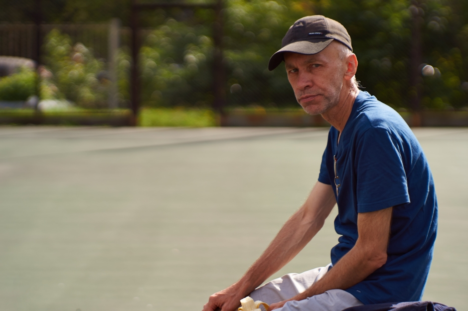

# От всей души благодарю

### Семью
Благодарю  родителей Илью и Ангелину за образование и воспитание. Благодарю брата Андрея, жену Елену, детей — Игнатия, Марию и Серафиму. Спасибо дедушке с бабушкой за то, что у нашей семьи есть дом.

### Учителей
Благодарю тех, кто повлиял на мой жизненный путь:
- Ирину Алимовну Воробьеву — учителя алгебры и геометрии. 
- Тамару Александровну Прохорову —  учителя русского языка и литературы. 
- Алексея Валерьевича Савватеева — популяризатора математики. 
- Маму, которая оплатила обучение в МИПК им. Ивана Федорова. 
- Киреева Сергея Александровича — инженера и строителя.
- Наталью Александровну Дьячкову — ректора миссионерского института. 
- Сергея Олеговича Горяева — преподавателя Латинского Языка.
- Священников Иоанна Парамонова, Игоря Стукова, Константина Корепанова, Сергия Алексеева.

#### Церковь
Благодарен отцу Даниилу из монастыря св. вмч. Феодора Стратилата в Крыму. Всегда есть соблазн выстроить у себя в голове альтернативную историю. Плохие решения лучше решений не принятых.

#### Авторов книг и компьютерных программ
Благодарю создателей открытого программного обеспечения: пакетов для обработки фото ImageMagick и видео ffMpeg. Создателей Obsidian, pandoc, создателя Linux — Линуса Торвальдса, автора книг по математике и программированию — Дональда Кнута.
