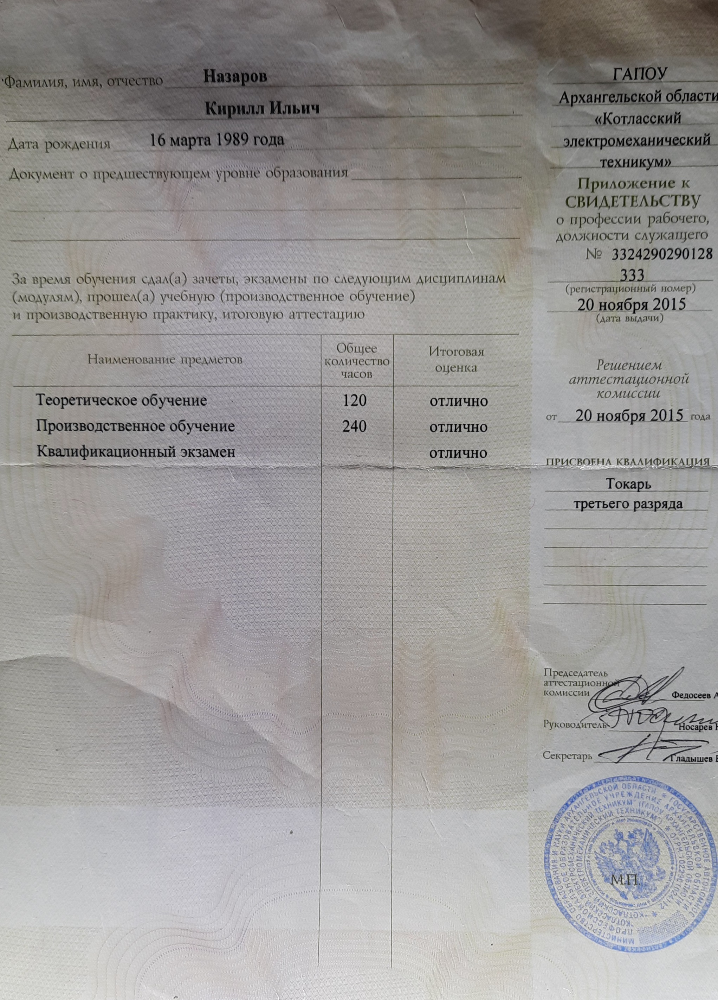

# Назаров Кирилл Ильич, 35 лет

## Образование
Свидетельство о профессии рабочего ГАПОУ Архангельской области «Котласский электромеханический техникум». Решением аттестационной комиссии от 20 ноября 2015 г. присвоена квалификация токарь третьего разряда. [Приложение к свидетельству о профессии рабочего.](assets/turner.jpg)

## Опыт работы

|Период       | Название организации | должность | суть работы |
|:------------|:---------------------|:---------:|:-------------------------|
|10/2017 12/2017|АО "НИЗМК"|токарь-универсал, заготовительный участок|нарезание резьбы с помощью вихревых головок|
|09/2019 06/2020|ООО «Уральский завод КДК» п. Верхнее Дуброво|станочник | линия склейки и линия фрезеровки клеенного бруса|
|02/2022 10/2022|Мебельная фабрика «Любимая кухня» | станочник | присадка деталей мебели на станке с ЧПУ|
|10/2022 07/2023|АО «НПП «Старт» им. А.И.Яскина»|токарь|единичные детали, болты, гайки, штифты|
<!-- |03/2018 08/2018|ООО "Сити-строй"|продавец-консультант|| -->
<!-- |08/2018 02/2021|ИП Бирюков М. Н. Инженерная служба "Теплоналадка"|инженер| проектирование систем вентиляции, теплоснабжения и канализации |
|04/2019 08/2019|ИП Семидоцкий А. В. "Аквасистемы"|сантехник, водитель| — | -->
<!-- ||ИП "Банные секреты"|||
||Поездка в Москву|||
||ИП "Вася всегда прав" & "Деревянные конструкции"
||и снова ИП "Банные секреты"|||
||коронавирус, попытка устроиться на удалёнку -->

## Языки 
Русский, Английский. 

## Профессиональные навыки и интересы
Работа на станках,  заточка инструмента

## Документы
- Медицинская книжка, водительские права категории "Б"

## Контакты 
kirilnazarov@gmail.com, 
https://vk.com/nazarov_ki, 
☎️ 8(953)825-41-76.

