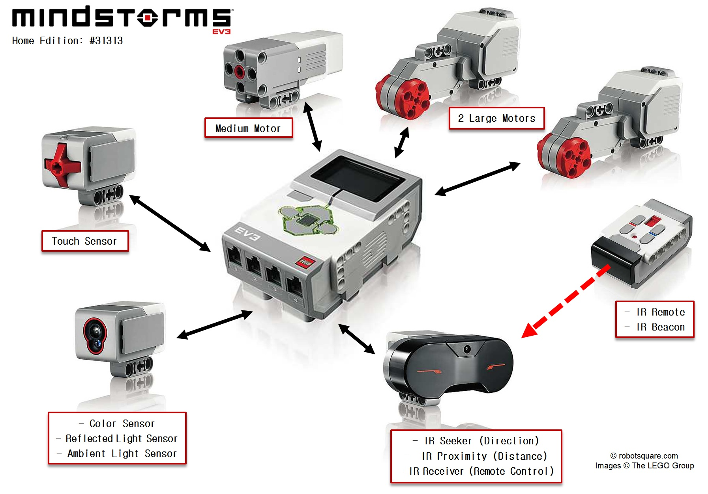

# Направления развития информатики и робототехники в гимназии

## Образовательная Робототехника
Требуется наличие 10 конструкторов [ev3](https://educube.ru/products/bazovyy-nabor-lego-mindstorms-education-ev3/), стоимостью 100 т.р. каждый и бесплатное обучение педагога в августе для работы с этими конструкторами. Если педагог будет активным, и будет участвовать во всех возможных детских соревнованиях, возможно получение гранта на предоставление конструкторов.

## Детский лагерь
Цель — создание движущийся радиоуправляемой игрушки с дальнейшей возможностью программирования сборки и сборки всей аппаратной части самостоятельно детьми из готовых модулей на основе Arduino.

## 3D Моделирование и 3D печать
Дети получают готовый каркас здания, которое они должны задекорировать различными архитектурными элементами изнутри и снаружи. 

Подобный проект реализовывался фондом [«Другой мир»](https://uraldobro.ru/katalog-nko/fond-podderzhki-i-razvitiya-socialno-ekonomicheskih-proektov-/) и предназначался для инклюзивной работы. Части экспозиции выставлена в музее на [Горького 4А](https://nashural.ru/mesta/sverdlovskaya-oblast/ekaterinburg/muzey-arhitektury-i-dizajna-urgahu/). Фонд ищет партнёров среди образовательных организаций для продолжения данного проекта в рамках образовательного процесса. Для реализации данного проекта нужен компьютерный класс укомплектованный 3D принтерами по количеству детей.

# Информатика и издательское дело
- Обучаем основам проектной деятельности и научной работы;
- Обучаем основам научной журналистики и издательской деятельности;
- Знакомим с современными инструментами управления знанием, принципами создания, редактирования текста, публикации в интернет пространстве.
Ценность проекта как y